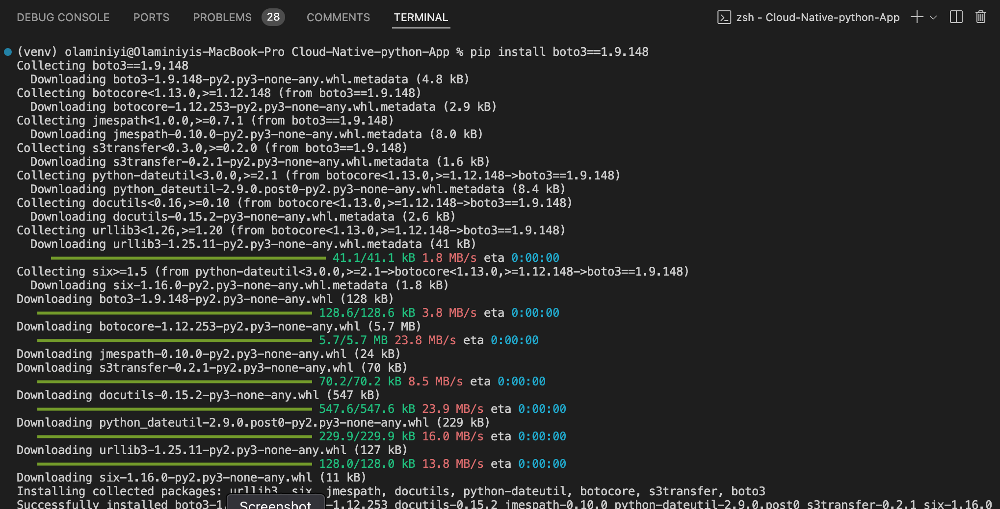

# Cloud-native-App

### we need to create a new virtual environment using phyton 3 because my current macos environment is been managed by homebrew

- To create a virtual environment, go to your project’s directory and run the following command. This will create a new virtual environment in a local folder named .venv:

                   python3 -m venv .venv

The second argument is the location to create the virtual environment. Generally, you can just create this in your project and call it .venv.

venv will create a virtual Python installation in the .venv folder.
### You should exclude your virtual environment directory from your version control system using .gitignore or similar.

- Activate a virtual environment

                  source .venv/bin/activate

- To confirm the virtual environment is activated, check the location of your Python interpreter:

                   which python

While the virtual environment is active, the above command will output a filepath that includes the .venv directory, by ending with the following:

- installing dependencies

- run application with python3
                  python3 app.py

- App Running on http://127.0.0.1:5000

To create  ECR resource on the AWS console with python, we need to  install or update the AWS SDK for Python.

The SDK is composed of two key Python packages: Botocore (the library providing the low-level functionality shared between the Python SDK and the AWS CLI) and Boto3 (the package implementing the Python SDK itself).

- install the latest Boto3 release via pip:
                  pip3 install boto3

- install other dependencies like flask and psutils
                  pip3 install psutils==5.8.0
                  pip3 install flask==2.2.3

- create ecr.py for ecr configurtion file

                import boto3

                ecr_client = boto3.client('ecr')

                repository_name = "my_monitoring_app_image"
                response = ecr_client.create_repository(repositoryName=repository_name)

                repository_uri = response['repository'] ['repositoryUri']
                print(repository_uri)

- run it with:
                  python3 ecr.py

- checked the console if the resource was created successfully

- create a Dockerfile for the application

 

 - build the image, you can check the image on your docker desktop app

 
 
 
 - run the image to know if the image was built correctly

- create a file ecr.py for creating Amazon ECR configuration

- run the file and check the resource on the aws console

            python3 ecr.py

- push the image by clicking on "view push push command in ecr repo", push the image with the following commands 

                aws ecr get-login-password --region us-east-1 | docker login --username AWS --password-stdin 992382761454.dkr.ecr.us-east-1.amazonaws.com

                docker build -t my_monitoring_app_image .

                docker tag my_monitoring_app_image:latest 992382761454.dkr.ecr.us-east-1.amazonaws.com/my_monitoring_app_image:latest

                docker push 992382761454.dkr.ecr.us-east-1.amazonaws.com/my_monitoring_app_image:latest

- check if the image was pushed successfully on the aws console

### we need to create kubenetes cluster on AWS for our application
- we need to install kubernetes, and also install eksctl to interact with kubernetes cluster using commmand line interface

            pip3 install kubernetes==10.0.1

- we will use eksctl to create the cluster from our CLI

      $ eksctl create cluster \
      --name cloud-Native-App \
      --region us-east-1 \
      --nodegroup-name worker \
      --node-type t2.micro \
      --nodes 3      

- check the aws for the resource created

- run the eks.py script to create service and deployment

- Expose port 5000 in the security group of the cluster

            kubectl port-forward svc/my-flask-service  5000:5000